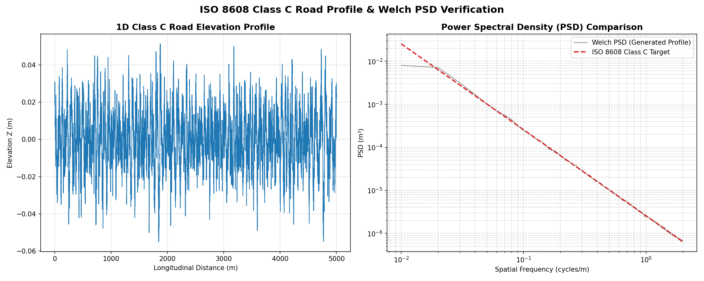
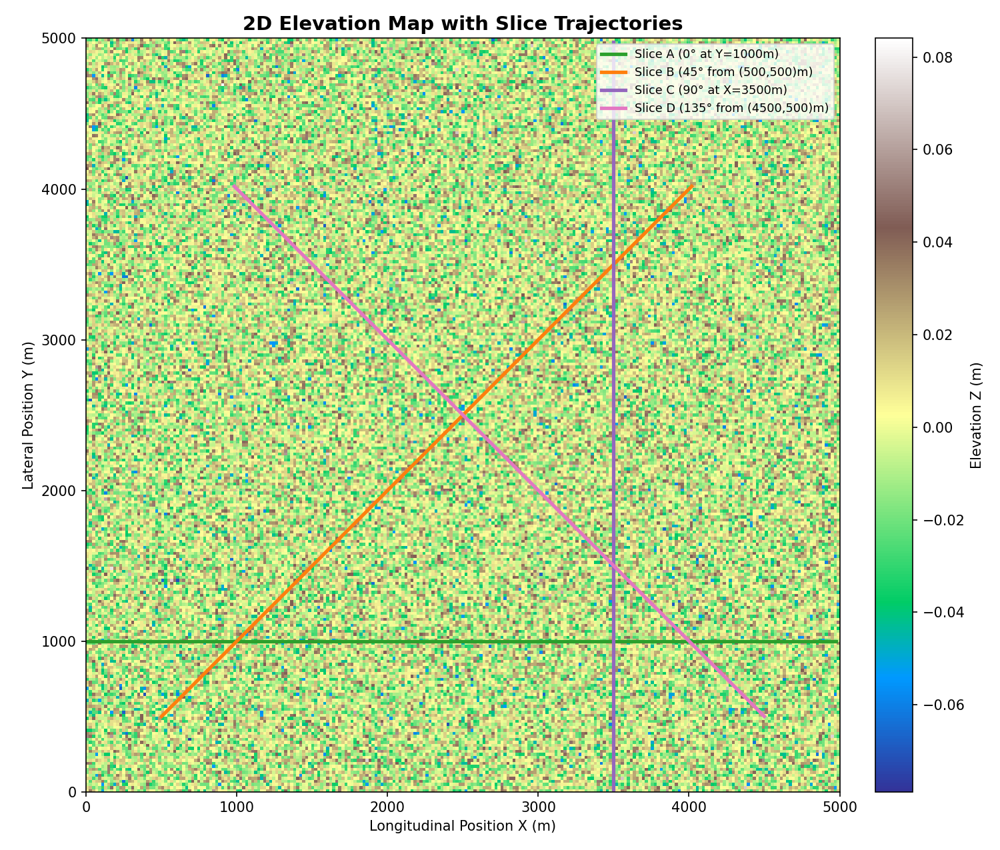
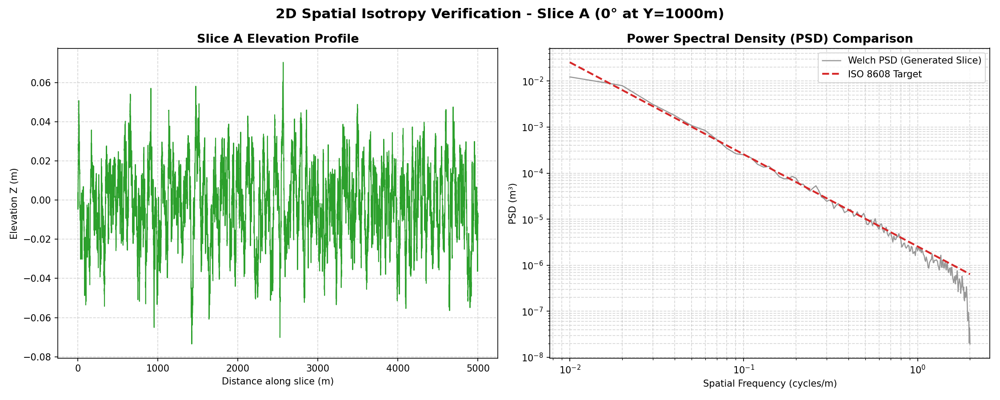
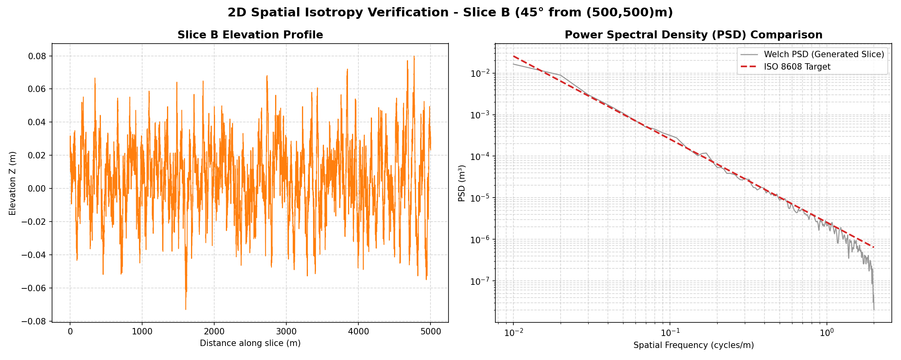
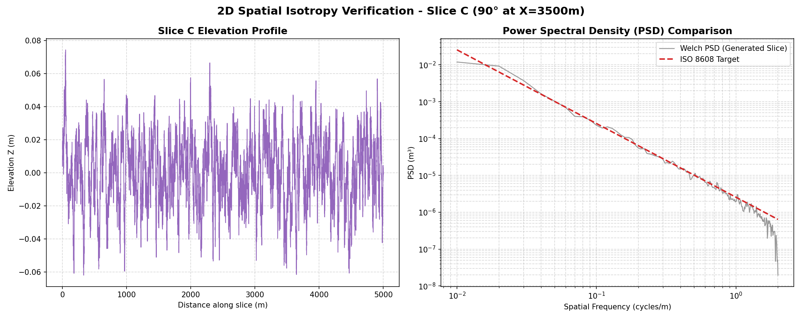
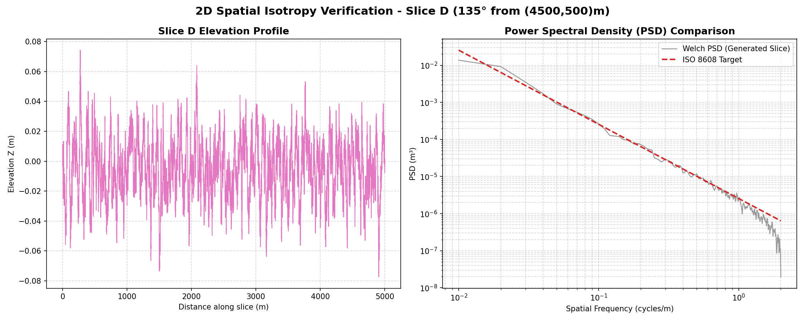

# 2D Infinite Isotropic Road Profile Generator FMU (ISO 8608 Compliant)

This repository contains a Functional Mock-up Unit (FMU) that dynamically generates a 2D infinite, isotropic, and deterministic road profile following the **ISO 8608** standard. 

The FMU is compliant with the **FMI 2.0 Co-Simulation standard** and is simplified to a query point $(x, y) \rightarrow z$. To simulate a full 4-wheel vehicle, the multibody simulator instantiates 4 separate instances of this FMU (one for each tire contact patch) using the same `seed` parameter, ensuring perfect cross-wheel spatial determinism.

---

## 1. ISO 8608 Standard Overview
The **ISO 8608** standard classifies road profiles based on their Power Spectral Density (PSD) of vertical displacement. The 1D spatial frequency PSD $G_d(n)$ is modeled using a power-law relationship:

$$G_d(n) = G_d(n_0) \left( \frac{n}{n_0} \right)^{-w}$$

Where:
- $n$: Spatial frequency (cycles/m).
- $n_0 = 0.1$ cycles/m: Reference spatial frequency.
- $w = 2.0$: Spatial frequency exponent.
- $G_d(n_0)$: Reference displacement PSD (roughness coefficient) at $n_0$, defining the road class:

| Road Class | Description | $G_d(n_0) \times 10^{-6}$ ($\text{m}^3$) |
| :--- | :--- | :---: |
| **Class A** | Very good | $16$ |
| **Class B** | Good | $64$ |
| **Class C** | Average | $256$ |
| **Class D** | Poor | $1024$ |
| **Class E** | Very poor | $4096$ |

---

## 2. Mathematical Formulation
To generate a 2D isotropic surface where a 1D slice in *any* direction matches the ISO 8608 power law, we utilize the **Spectral Representation Method (Sum-of-Sinusoids)**.

### Isotropic 2D PSD Projection
A 1D slice along any direction corresponds to integrating the 2D PSD $S_{2D}(f_x, f_y)$ over the transverse frequency $f_y$. Assuming isotropy, $S_{2D}(f_x, f_y) = S_{2D}(f_r) = C_2 f_r^{-\alpha}$ (where $\alpha = w + 1 = 3.0$), which yields:
$$S_{1D}(f_x) = 2 \int_{-\infty}^{\infty} S_{2D}(f_x, f_y) df_y = 2 C_2 f_x^{-w} I(\alpha)$$

where $I(\alpha) = \int_{-\infty}^{\infty} (1+t^2)^{-\alpha/2} dt$ is a standard numerical integral.

### Scaling Factor and Half-Circle Integration
To match the target ISO 8608 single-sided 1D displacement PSD $S_{1D}(f) = C_1 f^{-w}$ (where $C_1 = G_d(n_0) n_0^w$), the continuous scaling factor $C_2'$ is defined for the half-circle domain $[0, \pi)$:
$$C_2' = \frac{C_1}{I(\alpha)}$$

By restricting the angular discretization to $[0, \pi)$ and doubling the power density, we eliminate collinear propagation redundancy, double the angular resolution for a given $N_\theta$, and guarantee that the average PSD of the projected slices converges exactly to the target ISO 8608 power law.

---

## 3. Why 2D is Probabilistic vs. 1D is Deterministic with IFFT
* **1D Generation (Deterministic via IFFT)**: In 1D road generation using the Inverse Fast Fourier Transform (IFFT), discrete frequency bins are directly populated with the exact target PSD magnitudes. This ensures that the generated road profile matches the target PSD **exactly** (with zero variance).
* **2D Generation (Probabilistic)**: A 2D isotropic road profile is a continuous random surface. When a 1D slice is projected out of this 2D wave field, it represents a linear slice across a multi-directional isotropic grid of wave components. Because the waves are distributed across a continuous spatial grid at random angles and phases, any single 1D slice will experience statistical leakage and interference. Consequently, the PSD of an individual slice is a **random variable**. While any single slice may have minor fluctuations from the target, the **expected value (mean)** of the PSD over multiple realizations converges perfectly to the ISO 8608 curve.

---

## 4. Implementation Details

1. **Analytical Procedural Math (Sum-of-Sinusoids / Shinozuka Method)**:
   * Height $z(x, y)$ is evaluated analytically at the exact tire coordinates on demand. It is memoryless ($O(1)$ RAM footprint), spatially infinite (no domain or boundary limits), and requires zero grid caching.
2. **Native C++ Implementation (FMI 2.0 Compliance)**:
   * The production FMU is implemented in native C++ ([cpp_fmu/src/InfiniteRoadFMU.cpp](cpp_fmu/src/InfiniteRoadFMU.cpp)) for zero Python/ctypes wrapper overhead.
3. **Minimax Cosine Polynomial & AVX2 SIMD Autovectorization**:
   * Instead of standard `std::cos`, the C++ code uses a fast minimax polynomial approximation. Compiled with `/arch:AVX2 /fp:fast` flags, the MSVC compiler auto-vectorizes this to calculate 4/8 cosine values in parallel per clock cycle.
4. **Double Precision**:
   * The calculations utilize double-precision floating-point (`double`) representation to match the FMI standard (`fmi2Real`) and maintain numerical precision.

---

## 5. FMI Interface Specification

### Inputs
* `x` (Real): Longitudinal coordinate (m)
* `y` (Real): Lateral coordinate (m)

### Outputs
* `z` (Real): Road profile vertical height (m)

### Parameters
* `seed` (Integer, default = 42): Pseudorandom seed for phase generation.
* `road_class` (Integer, default = 3): ISO 8608 Class (1=A, 2=B, 3=C, 4=D, 5=E, 0=Custom Gd_n0).
* `Gd_n0` (Real, default = 256e-6 $\text{m}^3$): Reference displacement PSD at $n_0=0.1$ cycles/m (active when `road_class=0`).
* `w` (Real, default = 2.0): Exponent parameter.
* `f_min` (Real, default = 0.01 cycles/m): Lower frequency cutoff.
* `f_max` (Real, default = 2.0 cycles/m): Upper frequency cutoff.
* `Nf` (Integer, default = 512): Number of discrete frequency bins.
* `Ntheta` (Integer, default = 32): Number of discrete angular bins.
* `disable_math` (Integer, default = 0): Set to 1 to bypass evaluation for profiling.

> [!NOTE]
> **Frequency Cutoff Selection Reasoning**
> The defaults `f_min = 0.01` cycles/m (100m wavelength) and `f_max = 2.0` cycles/m (0.5m wavelength) are chosen to match the spatial discretization spacing $dx = 0.25\text{ m}$ and Welch window size $\text{nperseg} = 400$:
> * **Upper limit (`f_max = 2.0` cycles/m):** Derived from the spatial Nyquist frequency $f_{\text{Nyquist}} = \frac{1}{2 \cdot dx} = \frac{1}{2 \cdot 0.25} = 2.0\text{ cycles/m}$.
> * **Lower limit (`f_min = 0.01` cycles/m):** Derived from the minimum frequency resolution of the Welch segment size $f_{\text{low}} = \frac{1}{dx \cdot \text{nperseg}} = \frac{1}{0.25 \cdot 400} = 0.01\text{ cycles/m}$.

---

## 6. Visual Verification (1D Profile & 2D Isotropy)

### 1D Class C Road Profile
To verify the FMU's generation of standard road classes, a 5000m longitudinal profile (slice parallel to the X-axis) is queried on a Class C road ($G_d(n_0) = 256\times 10^{-6}\text{ m}^3$, $w=2.0$). 
* **Elevation Profile**: The left panel shows the continuous, vertical displacement $z$ along the length of the road.
* **Power Spectral Density**: The right panel shows the Welch-averaged spatial PSD compared directly to the analytical ISO 8608 Class C target.



### 2D Isotropy & Homogeneity at Offset Locations
A critical requirement of the 2D road profile is **isotropy**: a slice taken in *any* direction at *any* coordinate offset must yield identical spatial frequency properties. 

To demonstrate this, we generate a 5000m x 5000m Class C elevation map and evaluate 4 linear slices of length 5000m at different angles (0°, 45°, 90°, 135°) starting from offset (non-origin) coordinates:

**Trajectory Map:**


**Slice A (0° at Y=1000m):**


**Slice B (45° from (500,500)m):**


**Slice C (90° at X=3500m):**


**Slice D (135° from (4500,500)m):**


---

## 7. Repository Contents
* [infinite_road_fmu.py](infinite_road_fmu.py): Python source code defining the FMU model.
* [InfiniteRoadFMU.fmu](InfiniteRoadFMU.fmu): Compiled FMI 2.0 Co-Simulation compliant FMU package.
* [run_tests.py](run_tests.py): Verification suite runner that executes all test suites and generates plots and reports.
* [tests/](tests/): Subfolder containing verification suites:
  * [`fmu_validation/`](tests/fmu_validation/): FMI co-simulation compliance, concurrent multi-wheel query safety, and phase seed repeatability.
  * [`distance_homogeneity/`](tests/distance_homogeneity/): Spatial homogeneity validation at distances up to 100 km.
  * [`parameter_fitting/`](tests/parameter_fitting/): Log-log cumulative PSD parameter estimation and calibration mapping across road classes.
  * [`psd_analysis/`](tests/psd_analysis/): Welch-averaged PSD representation and exact isotropic cumulative model validation.
* [.gitignore](.gitignore): Excludes python caches and build/extraction directories.

---

## 8. How to Compile & Run

### Prerequisites
To compile the C++ FMU and execute verification tests, install:
* **C++ Compiler:** Visual Studio 2022 (MSVC) with C++ Desktop Development tools.
* **Build System:** CMake 3.10 or higher.
* **Python Environment:** Install testing libraries:
  ```bash
  pip install pythonfmu fmpy numpy scipy matplotlib
  ```

### Rebuilding the C++ FMU
To compile the C++ shared library (`InfiniteRoadFMU.dll`) and package it into `InfiniteRoadFMU.fmu`, run:
```bash
python build_cpp_fmu.py
```
This compilation is configured with `/arch:AVX2 /fp:fast` optimizations.

### Running the Full Verification Suite
To execute all verification scripts (including FMI co-simulation, homogeneity verification, parameter fitting, and PSD/terrain analysis) and regenerate all plots, run:
```bash
python run_tests.py
```
