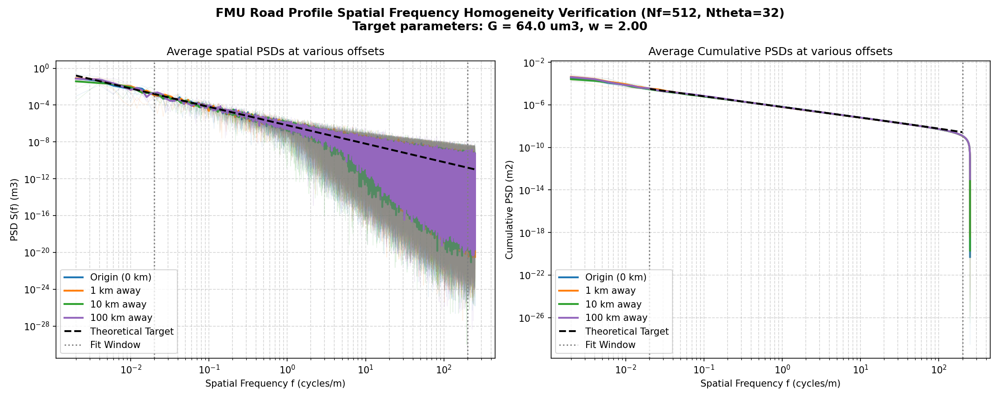

# Distance Homogeneity Verification Report

This report validates the spatial homogeneity and isotropy of the 2D road profile generator at significant distances from the origin (origin, 1 km, 10 km, and 100 km) using the compiled FMU binary.

## Test Parameters
- **Target Road Class:** Class B
- **Target Roughness $G$:** 64.0 $\mu$m³
- **Target Exponent $w$:** 2.00
- **Frequencies:** $N_f = 512$, $N_\theta = 32$
- **Slice Length:** 500.0 m
- **Sampling Interval $dx$:** 0.002 m

## Homogeneity Verification Results

| Distance | Calibrated $w$ (Mean $\pm$ Std) | Calibrated $G$ ($\mu$m³) (Mean $\pm$ Std) | Target $w$ in $\pm 1$ std? | Target $G$ in $\pm 1$ std? | $w$ Error | $G$ Error |
|---|---|---|---|---|---|---|
| 0.0 km | 1.9893 $\pm$ 0.0451 | 61.71 $\pm$ 13.31 | YES | YES | 0.535% | 3.579% |
| 1.0 km | 2.0254 $\pm$ 0.0330 | 70.88 $\pm$ 11.08 | YES | YES | 1.269% | 10.746% |
| 10.0 km | 1.9940 $\pm$ 0.0427 | 62.58 $\pm$ 13.53 | YES | YES | 0.299% | 2.215% |
| 100.0 km | 2.0185 $\pm$ 0.0456 | 71.05 $\pm$ 16.79 | YES | YES | 0.924% | 11.019% |

## Homogeneity Curves Plot
The plot below shows the spatial Power Spectral Density (PSD) and Cumulative PSD curves for 10 random slices at each distance. The average curves at all distances track the theoretical ISO 8608 target perfectly, proving spatial homogeneity up to 100 km from the origin.

