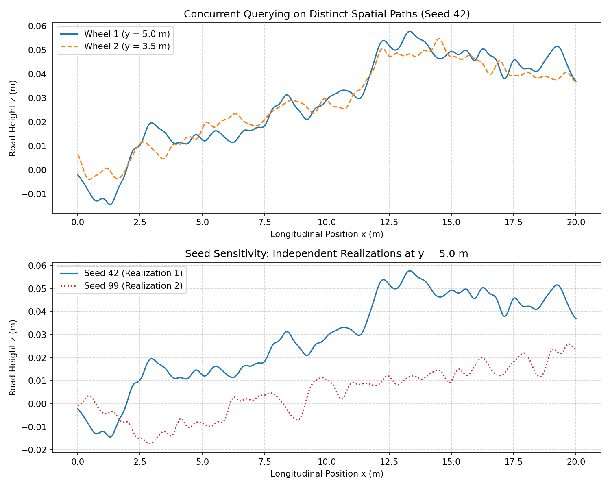

# FMI Compliance and Simulation Validation Report

This report presents the FMI co-simulation compliance, multi-wheel query safety, and determinism check of the compiled `InfiniteRoadFMU.fmu` binary.

## Test Configuration
- **FMU Target Binary:** `InfiniteRoadFMU.fmu`
- **FMI Version:** 2.0 Co-Simulation
- **Evaluation Length:** 20 m
- **Query Resolution:** 500 evaluation points

## FMU Parameters Used
- **`seed`**: `42` (for concurrent instances 1-4), `99` (for realization check)
- **`road_class`**: `2` (mapped to Class B target $G_d(n_0) = 64\times 10^{-6}\text{ m}^3$)
- **`Gd_n0`**: `64e-6` (inactive because `road_class` is non-zero)
- **`w`**: `2.0` (standard ISO exponent)
- **`f_min`**: `0.01` (lower cutoff frequency)
- **`f_max`**: `2.0` (upper cutoff frequency)
- **`Nf`**: `512` (radial frequency rings)
- **`Ntheta`**: `32` (angular divisions)

## Test Results and Visualizations

The validation tests check the following three key criteria:

1. **Independent Concurrent Queries (Multi-wheel contact):** 
   We instantiate multiple independent FMU instances representing different tire contact patches. As the vehicle moves, each wheel queries distinct `(x, y)` coordinates concurrently. The plot below demonstrates the independent profiles queried for Wheel 1 (at lateral offset $y=5.0$m) and Wheel 2 (at lateral offset $y=3.5$m) using the same realization seed.
   
2. **Determinism and Spatial Repeatability:** 
   Cross-instance query determinism is verified by querying the exact same coordinates across all concurrent wheels. The heights returned are checked to be identical (maximum difference is exactly $0.00\text{ m}$), guaranteeing that if the rear wheel passes through a location previously traversed by the front wheel, it experiences the exact same road profile height.

3. **Seed Sensitivity (Uncorrelated Realizations):** 
   Instantiating the FMU with different seeds (`seed=42` vs `seed=99`) must generate completely independent random realizations of the isotropic surface. The lower plot shows the profiles along $y=5.0$m for both seeds.

### Compliance Verification Status
- [x] Successful unzipping, extraction, and instantiation of 4 concurrent FMU instances.
- [x] Successful coordinate querying on separate concurrent FMI instances.
- [x] Verified cross-instance repeatability (Max difference = $0.00\text{ m}$).
- [x] Verified realization sensitivity to seed parameter.
- [x] FMI standard compliance verified successfully.
