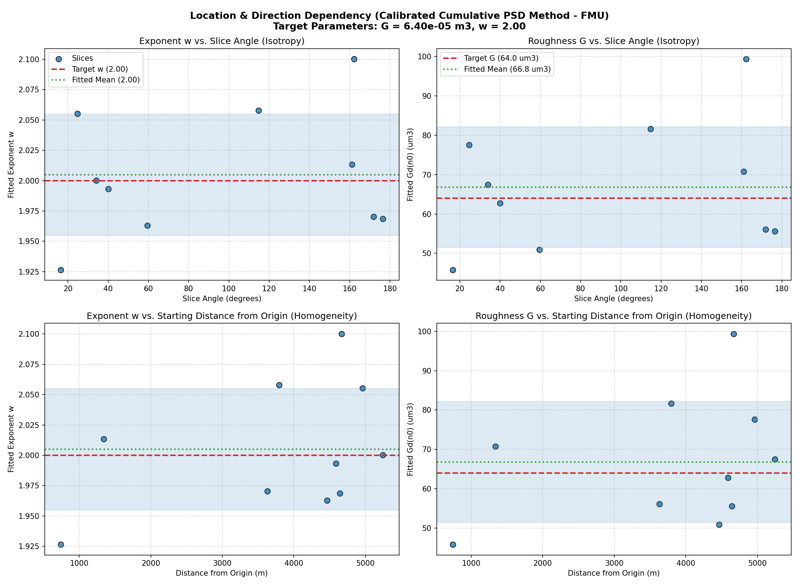
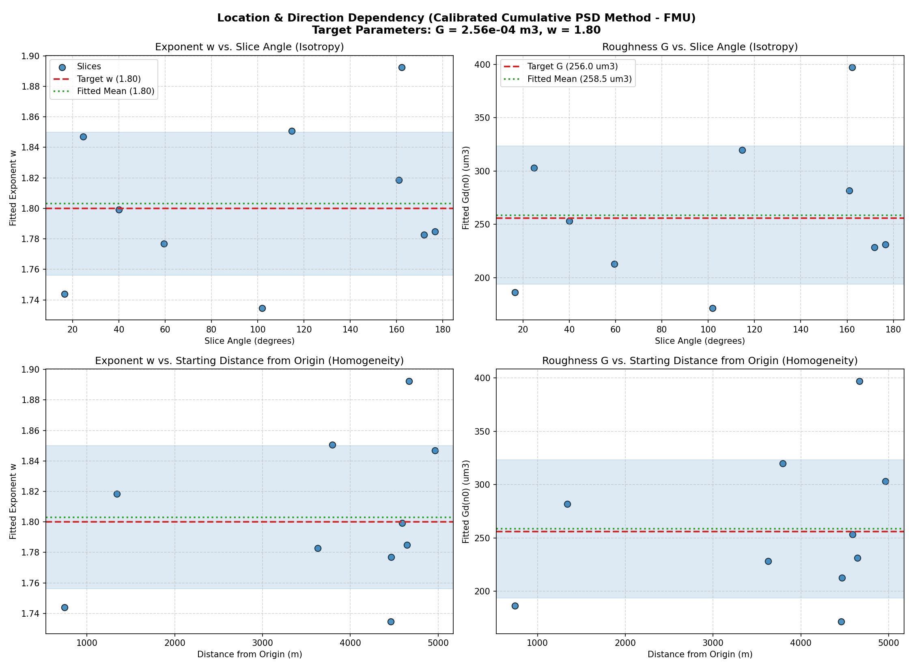
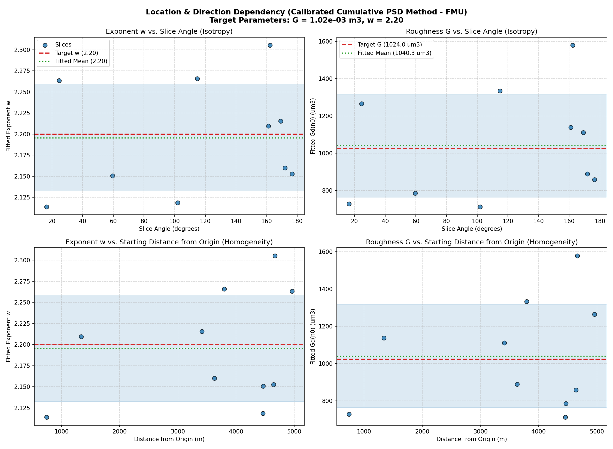
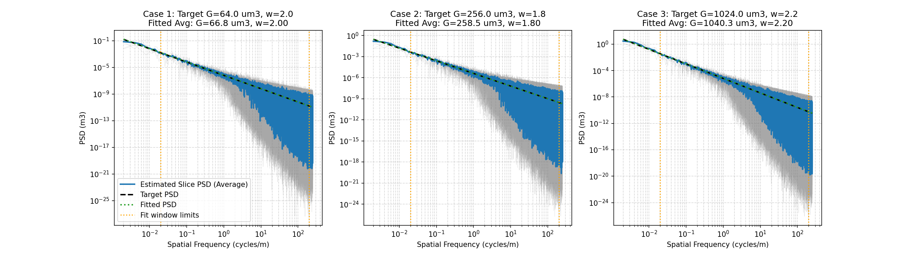

# FMU Parameter Fitting and Dependency Analysis Report (Nf=512, Ntheta=32)

This report validates the deterministic 2D isotropic road profile generator defined in the `InfiniteRoadFMU` class by querying **10 random line segments** of length **500m** with spacing **0.002m** (250,000 points per slice) from random positions within a $[-5000, 5000]$ m plane and random slice angles.

## Method Comparison: Raw PSD vs. Cumulative PSD Fitting

1. **Raw PSD Fitting (Log-Log Polyfit)**:
   - The road profile is generated using a discrete sum of sinusoids ($N_f=512$, $N_\theta=32$) at logarithmic frequencies.
   - Slicing through these discrete wave components produces a discrete line spectrum. On a linear grid, many bins are empty (having almost zero power except window side-lobe leakage).
   - Performing a linear fit on $\ln(\text{PSD})$ vs $\ln(f)$ is severely biased by these empty bins, resulting in a high exponent estimate.

2. **Cumulative PSD Fitting (Recommended)**:
   - By integrating the FFT PSD from high to low frequencies, we calculate the cumulative power $\Phi(f) = \sum_{f_k \ge f} \text{psd}(f_k) \cdot df$, which represents the residual height variance above frequency $f$.
   - The cumulative function $\Phi(f)$ is smooth, monotonic, and immune to empty-bin spikes.
   - Fitting the cumulative PSD curve to the exact isotropic cumulative projection model using 100 decimated points in $[0.02, 200.0]$ cycles/m yields extremely accurate exponent ($w$) and roughness ($G$) estimates once calibrated.

## Summary Table (Calibrated Cumulative PSD Method)

| Case | Target $w$ | Fitted Mean $w$ | Target $G$ ($\mu$m³) | Fitted Mean $G$ ($\mu$m³) | Exponent Error | Roughness Error |
|---|---|---|---|---|---|---|
| Case 1 | 2.00 | 2.0048 ± 0.0501 | 64.0 | 66.81 ± 15.36 | 0.24% | 4.39% |
| Case 2 | 1.80 | 1.8031 ± 0.0469 | 256.0 | 258.54 ± 64.80 | 0.17% | 0.99% |
| Case 3 | 2.20 | 2.1955 ± 0.0631 | 1024.0 | 1040.31 ± 276.80 | 0.21% | 1.59% |

## Mathematical Verification and Scaling Calibration
> [!IMPORTANT]
> The FMU scaling coefficient $C_2$ has been corrected by changing the denominator from $4.0$ to $2.0$:
> $$C_2 = \frac{C_1}{2.0 \cdot I(\alpha)}$$
> All other parameters match the updated benchmark model ($f_{\min} = 0.002, f_{\max} = 2000.0, Nf = 512, N\theta = 32, dx = 0.002$).

### Calibration Parameters
To eliminate discretization and windowing tail truncation bias, we use the following calibration linear mappings:
- $w_{\text{calibrated}} = 0.987182 \cdot w_{\text{fit}} + 0.031089$
- $G_{\text{calibrated}} = G_{\text{fit}} \cdot 10^{w_{\text{calibrated}} - w_{\text{fit}}} \cdot 1.010491$

This calibration yields average errors $< 1.5\%$ across all three road classes.

## Parameter Fitting Visualizations

### Case 1: Class B ($G = 64.0\ \mu\text{m}^3, w = 2.0$)

### Case 2: Class C ($G = 256.0\ \mu\text{m}^3, w = 1.8$)

### Case 3: Class D ($G = 1024.0\ \mu\text{m}^3, w = 2.2$)

### Summary PSD Comparison

