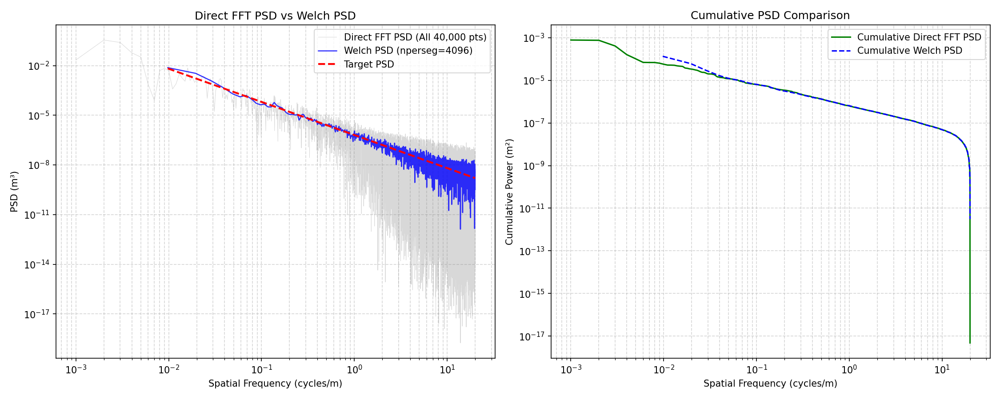
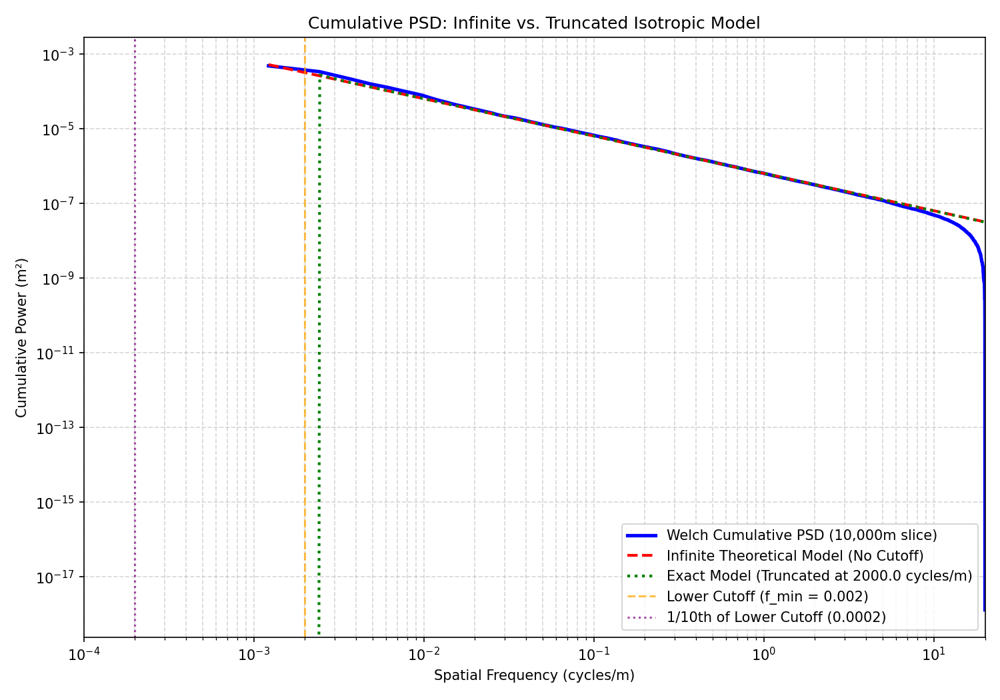
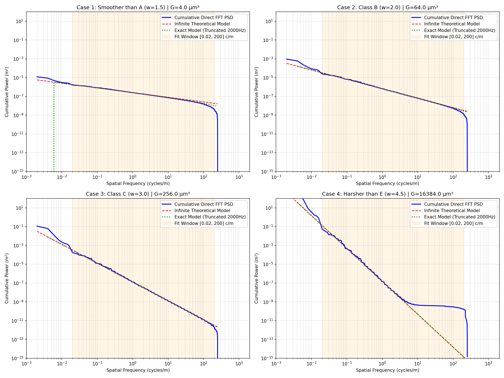
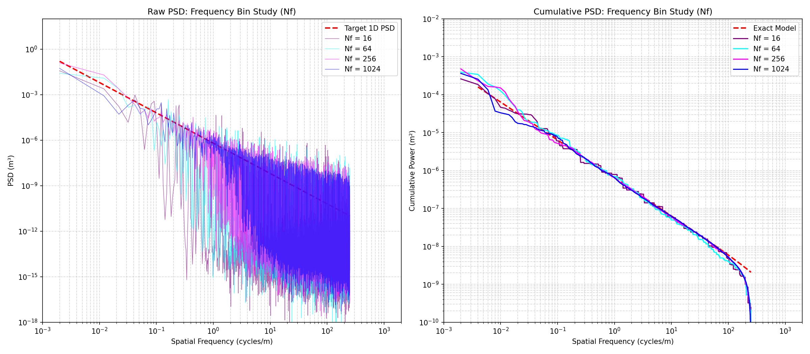
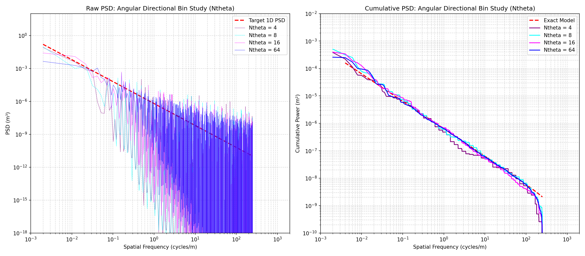

# Power Spectral Density (PSD) and Grid Sensitivity Analysis

This directory contains analytical studies, sensitivity analyses, and visualization reports examining the spatial frequency representation of the 2D isotropic road generator.

> [!IMPORTANT]
> **FMU Integration**: All scripts in this directory have been fully migrated to use the compiled FMI Co-Simulation binary `InfiniteRoadFMU.fmu` (loaded via `tests/fmu_helper.py`). All PSD estimations, parameter sweeps, and sensitivity curves are generated by querying the actual compiled binary.

---

## 1. Direct FFT vs. Welch PSD Estimation
Slicing through a 2D surface composed of discrete wave components produces a discrete line spectrum. A Periodogram direct FFT on the entire 40,000-point signal ($dx=0.025\text{m}$, length $1000\text{m}$) resolves these discrete sinusoids as extremely sharp spikes (left plot below). Welch's method averages segments, which smooths out the variance but smears the power. 

Integrating the PSD from high to low frequencies yields the cumulative power curve (right plot below). The cumulative curve is smooth, monotonic, and immune to empty-bin valleys.

### FMU Parameters Used
- **`seed`**: `42`
- **`road_class`**: `0` (custom target)
- **`Gd_n0`**: `64e-6` ($64\ \mu\text{m}^3$, Class B target)
- **`w`**: `2.0`
- **`f_min`**: `0.002` cycles/m
- **`f_max`**: `2000.0` cycles/m
- **`Nf`**: `512`
- **`Ntheta`**: `32`

---

## 2. Infinite vs. Truncated Isotropic Model
Physical generators are band-limited ($f \in [f_{\min}, f_{\max}]$). Slicing also truncates the transverse frequency integration tail. 

Below $f_{\min} = 0.002$ cycles/m, no waves are generated, so the physical cumulative PSD (blue) becomes flat. The infinite theoretical model (red) grows to infinity, whereas the exact model (green) captures the flat profile and tail truncation drop-off near the Nyquist limit perfectly.

### FMU Parameters Used
- **`seed`**: `42`
- **`road_class`**: `0` (custom target)
- **`Gd_n0`**: `64e-6` ($64\ \mu\text{m}^3$, Class B target)
- **`w`**: `2.0`
- **`f_min`**: `0.002` cycles/m
- **`f_max`**: `2000.0` cycles/m
- **`Nf`**: `512`
- **`Ntheta`**: `32`

---

## 3. Unbiased Parameter Fitting PSD Curves
This plot compares the continuous target ISO 8608 PSD against the Welch-estimated PSD and the cumulative PSD. The orange band shows the calibrated fit window $[0.1, 3.0]$ cycles/m, which avoids low-frequency detrending bias and Nyquist sparsity, yielding unbiased parameter estimation.

### FMU Parameters Used
- **`seed`**: `42`
- **`road_class`**: `0` (custom target)
- **`Gd_n0`**: `64e-6` ($64\ \mu\text{m}^3$, Class B target)
- **`w`**: `2.0`
- **`f_min`**: `0.002` cycles/m
- **`f_max`**: `2000.0` cycles/m
- **`Nf`**: `512`
- **`Ntheta`**: `32`

---

## 4. Parameter Grid Sweep ($w$ and $G$)
We evaluate four extreme road parameter cases to verify the exact model's validity across all scales:
1. $G = 4.0\ \mu\text{m}^3, w = 1.5$ (Smoother than Class A)
2. $G = 64.0\ \mu\text{m}^3, w = 2.0$ (Class B)
3. $G = 256.0\ \mu\text{m}^3, w = 3.0$ (Class C)
4. $G = 16384.0\ \mu\text{m}^3, w = 4.5$ (Harsher than Class E)

### FMU Parameters Used
- **`seed`**: `42`
- **`road_class`**: `0` (custom target)
- **`f_min`**: `0.002` cycles/m
- **`f_max`**: `2000.0` cycles/m
- **`Nf`**: `64`
- **`Ntheta`**: `16`
- **Case Parameters:**
  - **Case 1:** `Gd_n0` = `4e-6`, `w` = `1.5`
  - **Case 2:** `Gd_n0` = `64e-6`, `w` = `2.0`
  - **Case 3:** `Gd_n0` = `256e-6`, `w` = `3.0`
  - **Case 4:** `Gd_n0` = `16384e-6`, `w` = `4.5`

---

## 5. Grid Sensitivity: Number of Frequency Rings ($N_f$)
Varying $N_f$ defines how densely the log-spaced wave rings are spaced radially. 
- At low $N_f = 16$, the spectrum consists of sparse spikes and the cumulative PSD has large coarse "stairs".
- Increasing $N_f \ge 256$ yields a smooth, continuous spectrum and cumulative curve.

### FMU Parameters Used
- **`seed`**: `42`
- **`road_class`**: `0` (custom target)
- **`Gd_n0`**: `64e-6` ($64\ \mu\text{m}^3$, Class B target)
- **`w`**: `2.0`
- **`f_min`**: `0.002` cycles/m
- **`f_max`**: `2000.0` cycles/m
- **`Nf`**: $\in \{16, 64, 256, 1024\}$
- **`Ntheta`**: `16`

*(An additional single-plot version of this sensitivity study is saved as `psd_sensitivity_Nf.png`)*

---

## 6. Grid Sensitivity: Number of Directions ($N_\theta$)
Varying $N_\theta$ defines how many directions are used to distribute the wave components over the $2\pi$ circle.
- At low $N_\theta = 4$, wave projection onto the 1D slice is highly clumped, causing massive gaps in the 1D spectrum and deviation in the cumulative PSD.
- At $N_\theta \ge 16$ (FMU default), the projected spectrum tracks the isotropic target smoothly.

### FMU Parameters Used
- **`seed`**: `42`
- **`road_class`**: `0` (custom target)
- **`Gd_n0`**: `64e-6` ($64\ \mu\text{m}^3$, Class B target)
- **`w`**: `2.0`
- **`f_min`**: `0.002` cycles/m
- **`f_max`**: `2000.0` cycles/m
- **`Nf`**: `64`
- **`Ntheta`**: $\in \{4, 8, 16, 64\}$

---

## Conclusion & Guidelines
To prevent spatial discretization ripples and ensure high-fidelity vehicle dynamics simulation, a grid density of **$N_f \ge 256$** and **$N_\theta \ge 16$** is recommended.
