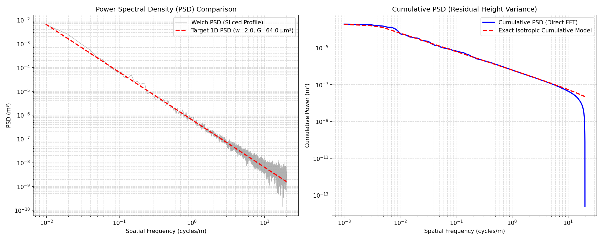
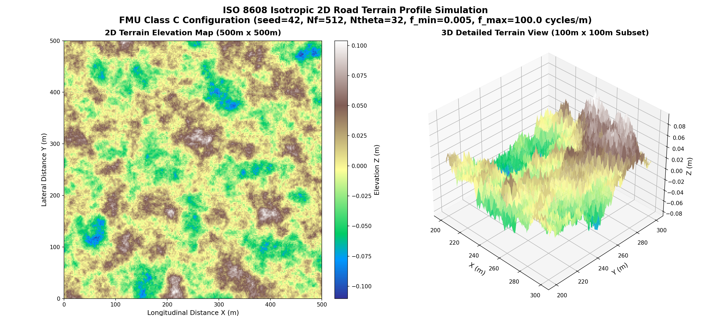

# Power Spectral Density (PSD) and Terrain Surface Validation

This directory contains scripts and visual validation reports examining the spatial representation of the 2D isotropic road generator.

---

## 1. PSD Comparison Validation (`plot_psd_comparison.py`)

This script validates the spatial frequency representation of sliced profiles from the 2D isotropic road generator. It queries the actual compiled FMI binary (`InfiniteRoadFMU.fmu`), computes the profile's Power Spectral Density (PSD) using Welch's method (50% overlap, Hanning window), and calculates the cumulative PSD (representing residual height variance).

The results are compared against:
1. **Target 1D Analytical PSD**: The theoretical continuous spectrum $S_{1D}(f) = C_1 f^{-w}$.
2. **Exact Isotropic Cumulative Model**: The mathematically exact cumulative power projection model including the low-frequency band-limit $f_{\min} = 0.005$ cycles/m:
   $$\Phi_{\text{exact}}(f) = \frac{2 C_1}{I} \int_{\max(f, f_{\min})}^{f_{\max}} f_{2D}^{-w} \arccos\left(\frac{f}{f_{2D}}\right) df_{2D}$$

### FMU Parameters Used
- **`seed`**: `42`
- **`road_class`**: `0` (custom target)
- **`Gd_n0`**: `64e-6` ($64\ \mu\text{m}^3$, Class B target)
- **`w`**: `2.0`
- **`f_min`**: `0.005` cycles/m
- **`f_max`**: `100.0` cycles/m
- **`Nf`**: `512`
- **`Ntheta`**: `32`

---

## 2. Isotropic 2D Terrain Elevation Map (`plot_terrain_surface.py`)

This script generates a full 2D terrain elevation profile covering a $500\text{m} \times 500\text{m}$ area for visual validation of the continuous 2D road surface.
- The 2D topography contour map (left) shows the isotropic wave propagation patterns and macro elevation structures over the entire 500m domain.
- The 3D surface mesh plot (right) renders a detailed $100\text{m} \times 100\text{m}$ subset, revealing the spatial wave crests, valleys, and local micro-roughness characteristics.

### FMU Parameters Used
- **`seed`**: `42`
- **`road_class`**: `3` (Class C target)
- **`f_min`**: `0.005` cycles/m
- **`f_max`**: `100.0` cycles/m
- **`Nf`**: `512`
- **`Ntheta`**: `32`

